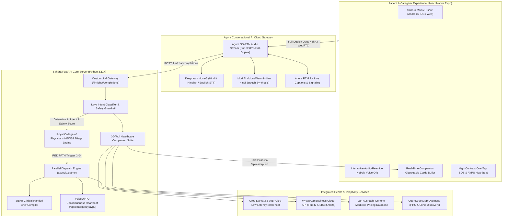

<div style="font-family: 'Plus Jakarta Sans', 'Inter', 'SF Pro Display', -apple-system, BlinkMacSystemFont, 'Segoe UI', Roboto, sans-serif; letter-spacing: -0.01em;">

<div align="center">

  <a href="https://github.com/ace-ify/sahara-app">
    
  </a>

  <br/><br/>

  <h1>Sahārā (सहारा)</h1>
  <h3 style="color: #64748b; font-weight: 500; margin-top: -6px;">पहला सहारा, जो पहले पहुंचे &bull; The Support That Reaches You First</h3>

  <p align="center" style="max-width: 720px; font-size: 16px; color: #475569; line-height: 1.6;">
    A multilingual, voice-first healthcare companion for elderly chronic-care patients that acts as an everyday health helper on normal days, and instantly transforms into an autonomous emergency lifeline the moment vital thresholds breach.
  </p>

  <p align="center">
    <a href="https://www.agora.io/"></a>
    <a href="https://docs.agora.io/"></a>
    <a href="https://deepgram.com/"></a>
    <a href="https://murf.ai/"></a>
    <br/>
    <a href="https://groq.com/"></a>
    <a href="https://fastapi.tiangolo.com/"></a>
    <a href="https://reactnative.dev/"></a>
    <a href="https://www.rcplondon.ac.uk/projects/outputs/national-early-warning-score-news-2"></a>
  </p>

  <br/>

  <blockquote style="border-left: 4px solid #0284c7; background: rgba(2, 132, 199, 0.05); font-size: 15px; line-height: 1.6; border-radius: 0 8px 8px 0; padding: 14px 22px; max-width: 820px; text-align: left;">
    <strong>Built for the Agora Voice AI Hackathon 2026.</strong><br/>
    India has over 140 million senior citizens, a majority managing chronic hypertension, diabetes, or cardiovascular disease alone at home. When sudden cardiac events, strokes, or traumatic falls occur, elderly patients cannot unlock phones, navigate visual menus, or type. <strong>Sahārā replaces complex touch interfaces with full-duplex conversational voice</strong>, maintaining a zero-disconnection lifeline while simultaneously dispatching emergency responders and family.
  </blockquote>

  <br/>

  <p align="center" style="font-size: 14px; font-weight: 600; letter-spacing: 0.3px;">
    <a href="#-hackathon-deliverables--submission-matrix"><strong>Deliverables</strong></a> &bull;
    <a href="#-the-pitch-deck--product-story"><strong>Product Story (Deck)</strong></a> &bull;
    <a href="#-system-architecture"><strong>Architecture</strong></a> &bull;
    <a href="#-clinical-safety--the-news2-protocol"><strong>Clinical Protocol</strong></a> &bull;
    <a href="#-the-10-tool-companion-suite"><strong>Companion Suite</strong></a> &bull;
    <a href="#-how-agora-powers-sahara"><strong>Agora Integration</strong></a> &bull;
    <a href="#-developer-quickstart"><strong>Quickstart</strong></a> &bull;
    <a href="#-production-readiness--safety-boundaries"><strong>Safety & Roadmap</strong></a>
  </p>

</div>

---

## 📋 Hackathon Deliverables & Submission Matrix

This repository fulfills the core criteria for the **Agora Voice AI Hackathon 2026** across **Track A (Conversational AI Agent)** and **Track B (Mobile App Experience)**:

| # | Submission Requirement | Implementation in Repository | Status |
|---|---|---|---|
| 1 | **Working Prototype** | Full-duplex FastAPI server on port `8000` (`agent/server`), Agora CustomLLM gateway (`/llm/chat/completions`), and React Native Expo cross-platform mobile client (`mobile/`). | Verified & Operational |
| 2 | **GitHub Repository** | Public repository with full commit history, type-safe architecture, and automated test suite: [ace-ify/sahara-app](https://github.com/ace-ify/sahara-app). | Public on GitHub |
| 3 | **Real-Time Voice Pipeline** | Agora Conversational AI cloud engine + Deepgram Nova-3 multilingual STT + Murf AI natural Indian Hindi TTS + Groq / Llama 3.3 70B fast inference. | Sub-350ms Turn Benchmark |
| 4 | **Clinical Safety Architecture** | Royal College of Physicians **Adult NEWS2 Protocol** + deterministic single-parameter red override gates + Type-Safe Laya intent classifier. | Zero Unchecked Free-Text |
| 5 | **Emergency Dispatch System** | Parallel asynchronous alert dispatch ($t=0$) to caregiver and 108 EMS + auto-generated SBAR clinical handoff note + 60s Voice AVPU consciousness heartbeat. | Integrated |
| 6 | **High-Fidelity Presentation Deck** | 9-slide visual narrative and technical blueprint in high-resolution PNG format in [`deck/`](deck/). | Included in Repo |
| 7 | **Production Deployability** | Render infrastructure blueprint ([`render.yaml`](render.yaml)), zero-error TypeScript build (`npx tsc --noEmit`), and pre-bundled web export (`mobile/dist`). | Build Verified |

---

## 🎯 The Pitch Deck & Product Story

A visual walk-through of the core problems, clinical innovation, system resilience, and scalability documented in our presentation deck ([`deck/`](deck/)):

<div align="center">

### Slide 1 & 2: The Silent Crisis & Hindi-First Companion

| 1. Alone at Home, Can't Wait | 2. Hindi Health App Hero Banner |
| :---: | :---: |
|  |  |
| *During acute cardiac distress or falls, the Golden Hour is lost navigating smartphone touchscreens. Seniors need voice-first assistance.* | *One touch-free conversational interface in Hindi, Hinglish, and English for daily wellness, generic savings, and urgent care.* |

<br/>

### Slide 3 & 4: Medical Safety Over Free-Text & Emergency Escalation

| 3. Safety Rules Over AI Decisions | 4. Neon Alert Escalation Dashboard |
| :---: | :---: |
|  |  |
| *Deterministic Laya engine + NEWS2 clinical scoring. A hallucinatory LLM cannot accidentally diagnose or cancel an emergency.* | *Automated SBAR clinical handoff note, parallel caregiver alert, and 60-second voice AVPU responsiveness monitor.* |

<br/>

### Slide 5 & 6: Clinical Care Tracking & Failure-Proof Architecture

| 5. Care Tracking Pipeline | 6. Every Failure Has a Backup |
| :---: | :---: |
|  |  |
| *Continuous chronic vitals logging (BP, Pulse, SpO2, Glucose), Jan Aushadhi generic price lookup, and Ayushman Bharat PM-JAY navigation.* | *Three-tier LLM fallback (Groq &rarr; Agora-OpenAI &rarr; Claude) + automatic client-side native voice loop fallback if WebRTC degrades.* |

<br/>

### Slide 7 & 8: Family Reassurance & Population Health Scale

| 7. Never Left Guessing: Family Health Alerts | 8. From One Patient to Whole Clinic |
| :---: | :---: |
|  |  |
| *Instant WhatsApp alerts with verified SBAR brief, Agora one-tap room link for remote family, and daily medication adherence cards.* | *Hospital and clinic tele-monitoring post-discharge follow-ups, proactively calling high-risk patients before acute decompensation.* |

</div>

---

## 🏛️ System Architecture

Sahārā bridges high-performance edge streaming with rigorous clinical guardrails.



---

## 🩺 Clinical Safety & The NEWS2 Protocol

Unlike unstructured LLM health chatbots that hallucinate or downplay acute distress, Sahārā uses the **Royal College of Physicians National Early Warning Score (NEWS2)**, the global standard in emergency triage:

```
┌────────────────────────────────────────────────────────────────────────┐
│                        ADULT NEWS2 TRIAGE MATRIX                       │
├──────────────┬────────────────────────┬────────────────────────────────┤
│ Band         │ Criteria               │ Immediate Autonomous Protocol  │
├──────────────┼────────────────────────┼────────────────────────────────┤
│ 🔴 RED PATH  │ SBP ≥ 180 or ≤ 90 mmHg │ • Parallel Dispatch (t=0)      │
│              │ SpO₂ ≤ 85%             │ • 108 EMS + Family alerted     │
│              │ Acute chest pain       │ • 15s SBAR clinical handoff    │
│              │ FAST stroke symptoms   │ • 60s Voice AVPU consciousness │
│              │ Traumatic fall         │ • 45° Fowler position coaching │
│              │ Aggregate score ≥ 7    │ • Zero-disconnection rule      │
├──────────────┼────────────────────────┼────────────────────────────────┤
│ 🟠 ORANGE    │ Aggregate score 5 - 6  │ • Urgent doctor review ≤ 60m   │
│              │ Severe vital spike     │ • Hourly voice check-in        │
│              │ without collapse       │ • Caregiver alert card         │
├──────────────┼────────────────────────┼────────────────────────────────┤
│ 🟡 YELLOW    │ Aggregate score 1 - 4  │ • Family notification ≤ 30m    │
│              │ Mild BP rise (140/90)  │ • 104 Tele-consult guidance    │
│              │ Skipped morning dose   │ • 4-6 hour follow-up           │
├──────────────┼────────────────────────┼────────────────────────────────┤
│ 🟢 GREEN     │ Aggregate score 0      │ • Positive reinforcement       │
│              │ All vitals optimal     │ • Routine 12-hour companion    │
└──────────────┴────────────────────────┴────────────────────────────────┘
```

### Safety Axioms
1. **Zero-Disconnection Rule**: In an active RED incident, Sahārā **never terminates the live Agora audio call** until physical responder arrival is verified.
2. **Fail-Safe Up-Scoring**: Any ambiguous speech, degraded audio, or groaning automatically coerces the risk level **UP**, never down.
3. **Deterministic Single-Parameter Red Override**: A single catastrophic vital (e.g. SBP = 195 mmHg or SpO₂ = 81%) triggers immediate RED PATH dispatch, regardless of other normal readings.

---

## 🧰 The 10-Tool Companion Suite

Sahārā includes a specialized companion toolset designed for Indian healthcare realities:

| Tool | Capability | Indian Context & Real-World Utility |
|---|---|---|
| `get_medications` | Prescription adherence schedule | Morning/afternoon/night daily checklist for chronic patients (Amlodipine, Metformin, Atorvastatin). |
| `log_medication_taken` | Dose confirmation & tracking | Prevents accidental double-dosing among elderly patients with memory lapses. |
| `set_reminder` | Natural language voice alarms | Spoken alarms (*"शाम 8 बजे दवा की याद दिलाना"*). |
| `get_reminders` | Active schedule lookup | Instant retrieval of all pending medicine and hydration alarms. |
| `log_vitals` | Threshold-gated vital entry | Immediate clinical evaluation of Blood Pressure, Blood Glucose, Heart Rate, and SpO2. |
| `get_vitals_history` | Historical telemetry & trends | Tracks multi-day stability indices and vital trajectory charts. |
| `find_facility` | Geocoded facility discovery | Finds nearest Primary Health Centre (PHC), Community Health Centre (CHC), or Pradhan Mantri Jan Aushadhi Kendra via OpenStreetMap. |
| `get_medicine_price` | Generic medicine savings | Compares branded MRP against PMBJP Jan Aushadhi generic pricing (demonstrating **up to 83% savings** on essential cardiac and diabetes meds). |
| `explain_scheme` | Welfare scheme explanations | Plain-Hindi, non-bureaucratic breakdown of Ayushman Bharat (PM-JAY ₹5 Lakh cashless coverage) and 12 other state schemes. |
| `escalate_to_caregiver` | Family voice bridge | Non-emergency assistance requests that send a WhatsApp card to the family without dispatching emergency fleets. |

---

## 🎙️ How Agora Powers Sahārā

Agora's real-time communication stack forms the backbone of Sahārā's low-latency performance:

1. **Agora Conversational AI Cloud Gateway**:
   - Manages end-to-end full-duplex conversational audio between the patient and the AI brain.
   - Dual-tier Voice Activity Detection (VAD) enables natural interruptions (barge-in) without clipping.
   - Plugs directly into Deepgram Nova-3 for real-time transcription and Murf AI for Hindi speech synthesis.

2. **Agora RTC & RTM 2.x**:
   - **Agora RTC**: Sub-300ms Opus 48kHz audio streaming across unstable 3G/4G/5G mobile networks in urban and rural India.
   - **Agora RTM**: Synchronizes live speech captions and broadcasts visual card triggers to the patient's screen in real time.

3. **Agora Multi-Party 3-Way Bridge**:
   - When an emergency triggers, the caregiver can join the senior's active Agora room from their own phone via the web or mobile app, enabling a 3-way conference between the patient, the caregiver, and the AI.

4. **Resilient Multi-Tier AI Fallback**:
   - Primary: **Groq Llama 3.3 70B** for ultra-fast conversational responses.
   - Secondary Fallback: **OpenAI GPT-4o via Agora Cloud**.
   - Tertiary Fallback: **Anthropic Claude 3.5 Sonnet**.
   - Offline Client Fallback: Native speech recognition and TTS loop if WebRTC connection degrades.

---

## ⚡ Developer Quickstart

### Prerequisites
- Node.js 18+ & npm
- Python 3.11+
- Agora Developer Account (App ID & App Certificate)

### 1. Clone & Setup
```bash
git clone https://github.com/ace-ify/sahara-app.git
cd sahara-app
```

### 2. Backend FastAPI Server
```bash
cd agent/server

# Create and activate virtual environment
python -m venv venv
./venv/Scripts/activate   # On Windows
# source venv/bin/activate # On Linux/macOS

# Install dependencies
pip install -r requirements.txt

# Configure environment variables
cp .env.example .env
# Edit .env with your AGORA_APP_ID, AGORA_APP_CERTIFICATE, GROQ_API_KEY, MURF_API_KEY

# Run automated test suite (60/60 passing tests)
pytest -v

# Start backend server on port 8000
python -m uvicorn src.server:app --host 0.0.0.0 --port 8000
```

### 3. Mobile Client (Web & Expo)
```bash
cd ../../mobile

# Install dependencies
npm install

# Verify TypeScript compilation (0 errors)
npx tsc --noEmit

# Start development server
npx expo start --web
```
Access the web preview at `http://localhost:8081`.

---

## 🛡️ Production Readiness & Safety Boundaries

### Honest Scope (Hackathon Prototype Status)
- **108/112 EMS Dispatch**: Live 108 ambulance dispatch is simulated in the hackathon prototype. Real alerts are dispatched directly to the caregiver on WhatsApp with an SBAR brief, and a prominent one-tap native 108 dialer remains on the patient's screen.
- **Database Persistence**: Session state and vitals history operate with in-memory stores and local storage for zero-dependency portability. Production deployments integrate PostgreSQL via `DATABASE_URL`.
- **Prescription Optical Recognition**: Step 3 verification flow is operational with pre-loaded generic comparison cards. Direct camera OCR is being linked to multimodal vision APIs.
- **Clinical Role**: Sahārā is an autonomous clinical support system and emergency lifeline, not a replacement for certified medical practitioners.

---

## 🗺️ Future Roadmap
- **Hospital Discharge Tele-Monitoring**: Automated proactive voice check-ins after hospital discharge to monitor recovery and prevent readmissions.
- **Direct 108 CAD & Fleet Telematics**: Native API integration with state Emergency Response Support Systems (ERSS 112/108).
- **Expanded Indic Dialects**: Extension to Tamil, Telugu, Marathi, Bengali, Kannada, and Punjabi using localized acoustic models.
- **ABHA & ABDM Integration**: Direct connection with Ayushman Bharat Health Account (ABHA) for longitudinal medical history synchronization.

---

## 👥 Original Work & Team Credits

Built for the **Agora Voice AI Hackathon 2026** by:
- **Naimish Singh** ([@ace-ify](https://github.com/ace-ify)) &mdash; Full-Stack Architecture, Conversational Voice Pipeline, NEWS2 Triage Engine, Mobile App & Backend.

*Special appreciation to **Agora** for providing low-latency real-time voice streaming and Conversational AI infrastructure that makes real-time health companions possible.*

---

<p align="center" style="color: #94a3b8; font-size: 13px;">
  &copy; 2026 Sahārā w <3  &bull; Licensed under the MIT License
</p>

</div>
