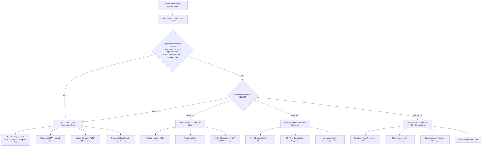

# Sahārā (सहारा) — Product Requirements Document
> Tagline: **"The support that reaches you first."** (पहला सहारा, जो पहले पहुंचे)  
> Agora Voice AI Hackathon 2026 · AI Mobile Coders × Agora · Track A & B Implementation Blueprint

---

## 1. Executive Summary & Vision
**Sahārā** is a Hindi-first, voice-first healthcare companion for elderly and chronic-care patients across India (both rural and urban). Patients interact through natural conversational speech. The moment a critical symptom, severe vital derangement, or distress is detected, Sahārā **transforms into an active emergency lifeline**:
- It **never disconnects** the call.
- It initiates **parallel emergency dispatch** at $t=0$ (108/112 EMS + Family Caregiver).
- It continuously monitors patient consciousness via **Voice-First AVPU heartbeats**.
- It delivers automated **SBAR clinical handoff briefs** the instant human responders enter the Agora RTC channel.
- It coaches the patient through pre-arrival stabilization while keeping them calm.

---

## 2. Target Users & Operating Reality

| Persona | Environment | Primary Interaction | Pain Point Addressed |
|---|---|---|---|
| **Primary: Elderly Patient** (60+ yrs) | Home / Alone / Urban or Rural | Voice speech in Hindi / Hinglish. Zero typing or complex menu navigation. | Sudden cardiac distress, stroke, or falls go unassisted due to confusion, panic, or inability to dial/operate an app. |
| **Secondary: Family Caregiver** (Son/Daughter/Spouse) | Remote / Working in city / Nearby | Instant multi-modal alert (Push, SMS, Live Card), 1-tap join to patient's live Agora call. | Blindness to parents' acute deterioration; delays in getting informed. |
| **Tertiary: First Responders (108/112 EMT / ER Team)** | Ambulance / Hospital ER | Automated SBAR Handoff Brief (Data payload + Verbal handoff on call join). | "Zero information" arrival; 15-20 min wasted taking basic history during the Golden Hour. |

---

## 3. Product Architecture & Hackathon Core Principle

> **CRITICAL HACKATHON DIRECTIVE**:  
> **The Agora Conversational Voice Agent is the hero.** All clinical algorithms, scoring systems, and tools must empower the *voice persona* so Saathi sounds like an empathetic, clinically trained senior triage specialist over ultra-low-latency Agora RTC audio. We reject administrative EHR bloat in favor of voice-first conversational excellence.

```
┌────────────────────────────────────────────────────────────────────────┐
│                   Patient Bare React Native Mobile App                 │
│  - Agora RTC Audio Stream (Full-Duplex, Noise Cancellation, VAD)       │
│  - Live Audio Level Waveform (Skia) & Visual StateBadge                │
│  - Dynamic Glanceable Cards Sync (Pushed from Backend)                 │
│  - High-Contrast One-Tap SOS & Native 108 Fallback                      │
└───────────────────────────────────┬────────────────────────────────────┘
                                    │ WebRTC Full Duplex Audio
                                    ▼
┌────────────────────────────────────────────────────────────────────────┐
│                   Agora Conversational AI Cloud Gateway                │
│  - STT: Deepgram Nova-3 (Hindi/Hinglish/English Multilingual)          │
│  - CustomLLM Vendor: Routed to Sahārā Python Brain                     │
│  - TTS: Murf / Cartesia / ElevenLabs (Warm, Calm Indian Voice)         │
└───────────────────────────────────┬────────────────────────────────────┘
                                    │ POST /llm/chat/completions
                                    ▼
┌────────────────────────────────────────────────────────────────────────┐
│               Sahārā Python Backend Brain (FastAPI)                    │
│  ├─ Laya Semantic Classifier & Intent Engine (10 Companion Tools)      │
│  ├─ Clinical Triage Engine (Adult NEWS2 + Single-Param Red Trigger)    │
│  ├─ Parallel Dispatch Ladder (108/112 EMS + Caregiver at t=0)          │
│  ├─ Dynamic AVPU Voice Consciousness Monitor                           │
│  ├─ SBAR Clinical Handoff Brief Generator                              │
│  └─ Active Glanceable Card Buffer (/api/card/latest & /api/card/push)  │
└────────────────────────────────────────────────────────────────────────┘
```

---

## 4. The 10-Tool Companion Suite

Sahārā includes 10 fully operational domain tools integrated into `tools.py`, `server.py`, and `laya.py`:

| # | Tool Name | Scope & Purpose | Clinical / Everyday Value |
|---|---|---|---|
| 1 | `get_medications` | Retrieves today's active prescription schedule and taken status. | Daily adherence check for hypertension, diabetes, and heart disease. |
| 2 | `log_medication_taken` | Confirms dosage taken; updates timestamp and adherence record. | Prevents accidental double-dosing or missed morning BP pills. |
| 3 | `set_reminder` | Natural language voice alarm/reminder scheduler. | Patients say *"दोपहर 2 बजे दवा की याद दिलाना"* without opening clock apps. |
| 4 | `get_reminders` | Lists all active medication and wellness alarms. | Complete visibility of scheduled patient reminders. |
| 5 | `log_vitals` | Logs numeric vitals (BP, Sugar, Pulse) with clinical triage gates. | Instant threshold check (e.g. SBP > 180 mmHg flags Hypertensive Crisis). |
| 6 | `get_vitals_history` | Returns historical readings, timestamps, and trend directions. | Distinguishes isolated spikes from progressive deterioration. |
| 7 | `find_facility` | Locates nearest Medical Center, PHC, CHC, or Jan Aushadhi Kendra. | Instant geographic navigation and direct phone connection. |
| 8 | `get_medicine_price` | Jan Aushadhi generic price comparison against branded MRP. | Demonstrates massive out-of-pocket savings (e.g. ₹48 branded vs ₹8 generic). |
| 9 | `explain_scheme` | Explains Ayushman Bharat (PM-JAY) and state health scheme coverage. | Clarifies free hospital treatment entitlements in simple Hindi. |
| 10 | `escalate_to_caregiver` | Triggers a non-emergency notification to family (e.g. Ramesh). | Handles domestic help requests without triggering ambulances. |

> **Note on First Aid**: No static database tool is created for first-aid. The LLM handles minor first-aid (bandaging, burns, resting position) using its intrinsic clinical intelligence. In acute crises, the **Laya Engine** overrides conversational output to enforce emergency latching.

---

## 5. Clinical Triage Engine: Multi-Band Protocol (Adult NEWS2)

Adapted from the Royal College of Physicians (RCP) **NEWS2** guidelines for out-of-hospital ambulatory and home care:



### The 4 Severity Bands:

#### 1. RED PATH: Life-Threatening Acute Crisis
- **Triggers**:
  - **Single-Parameter Red Override**: Systolic BP $\ge 180$ or $\le 90$ mmHg; SpO₂ $\le 85\%$; Pulse $\ge 130$ or $\le 45$ bpm.
  - **Acute Voice Red Flags**: Retrosternal crushing chest pain radiating to arm/jaw; FAST stroke symptoms (slurred speech, facial droop, arm weakness); syncope / severe fall with loss of consciousness; acute respiratory distress.
  - **Aggregate NEWS2 $\ge 7$**.
- **Actions**:
  1. **Parallel Dispatch ($t=0$)**: Simultaneous trigger of **108/112 EMS** and **Primary Caregiver Alert** via `asyncio.gather`.
  2. **Receiving Hospital Alert**: Forward incoming patient payload to nearest trauma/cardiac ER.
  3. **Auto-Generate SBAR Brief**: Pushed to mobile screen and CAD buffer.
  4. **Dynamic Voice AVPU Monitoring**: 60-second conversational pulse check.
  5. **Pre-Arrival Coaching**: 45° Fowler's position, airway clearance, unlock front doors.

#### 2. ORANGE PATH: Medium Risk / Subacute Deterioration
- **Triggers**: Aggregate NEWS2 score **5–6** OR isolated severe derangement without immediate collapse (e.g. SBP 165 mmHg with severe headache; SpO₂ 88-91%).
- **Actions**:
  1. Urgent clinical review alert targeted within 60 minutes.
  2. Hourly monitoring re-check scheduled.
  3. Push Orange Warning Card to patient and caregiver.
  4. Verbal counseling to sit down and rest.

#### 3. YELLOW PATH: Low Risk / Mild Derangement
- **Triggers**: Aggregate NEWS2 score **1–4** (e.g. mild BP elevation 140/90, skipped meds for 24h, mild dizziness).
- **Actions**:
  1. Responsible family doctor / clinic alert within 30 minutes.
  2. Suggestion for 104 Government Tele-consultation.
  3. Increase vitals logging frequency to 4–6 hourly.

#### 4. GREEN PATH: Stable / All Clear
- **Triggers**: Aggregate NEWS2 score **0** (all vitals within optimal range, no red-flag complaints).
- **Actions**:
  1. Positive verbal affirmation (*"बाबूजी, आपकी सेहत बिल्कुल स्थिर है"*).
  2. Continue routine 12-hourly check-ins.
  3. ASHA / CHW scheduled for routine preventive follow-up.

---

## 6. Emergency Call Dynamics & Lifecycle

### 6.1 The Zero-Disconnection Rule (Golden Principle)
When a Red-Path crisis triggers, **the call NEVER disconnects**.
- Saathi AI remains live on the Agora RTC audio channel as a comforting, stabilizing presence.
- System prompt injection restricts the AI from giving long medical discourses; it speaks in short, calming sentences (10–15 words) at 0.92x cadence.

### 6.2 Parallel Dispatch ($t = 0$)
Rather than waiting sequentially, both primary lifelines are alerted simultaneously:
```python
await asyncio.gather(
    dispatch_ems_108(incident),
    alert_primary_caregiver(incident),
    push_emergency_card(incident.channel, sbar_card),
)
```

### 6.3 Handoff Brief Timing & SBAR Standard
Handoff information is delivered in two distinct modalities:
1. **Instant Data Card ($t = 0$)**: Pushed immediately to the Caregiver app and 108 CAD buffer. The patient is *not* read clinical jargon that could amplify panic.
2. **Verbal SBAR Handoff ($t = \text{Responder Join}$)**: The moment an EMT, ER Doctor, or Caregiver enters the Agora RTC channel and un-mutes, Saathi speaks a crisp 15-second clinical verbal brief:
   > *"SBAR Brief: 72-year-old male, known hypertensive on Amlodipine. Sudden severe substernal chest pain with diaphoresis since 10:14 AM. Last recorded BP is 190/115 mmHg. Patient is conscious and seated in Fowler's position. 108 ALS dispatched."*
   > *Following this brief, the AI steps back into passive translation/notetaker mode.*

### 6.4 The 10–15 Minute Transit Window (What the Agent Does While Fleet Arrives)
1. **Pre-Arrival Coaching**:
   - Instructs patient to sit at a 45-degree angle (Fowler's position) to ease cardiac preload.
   - Tells family/bystanders to unlock the front door and gather physical medicine strips and Aadhaar/Ayushman cards.
2. **Dynamic Consciousness Monitoring (Voice-First AVPU Heartbeat)**:
   - Every 60 seconds, Saathi conducts a conversational check:
     > *"बाबूजी, क्या आप सुन पा रहे हैं? बस एक बार 'हाँ' बोलिए।"*
   - **Vocal Response Detected (VAD)**: Patient is Alert (A) or Vocal (V). Saathi reassures them: *"बहुत अच्छे बाबूजी, सांसें धीमी रखिए।"*
   - **Silence for 15s**: Re-check with audio chime.
   - **Double Silence (No vocal response)**: AVPU drops to **Unresponsive (U)**.
     - **Instant Broadcast Escalation**: AI broadcasts to incoming fleet:
       > *"CRITICAL UPDATE: Patient has become unresponsive (AVPU: U). Suspected arrest/syncope. Prepare defibrillator and ALS resuscitation."*
   - **Screen Fallback**: A prominent green *"मैं ठीक हूँ (I'm OK)"* touch target is also rendered for patients with speech fatigue.
3. **Vagal Calming**: Empathetic, low-frequency speech to suppress adrenaline surges and protect ischemic myocardium.

### 6.5 Disconnection & Call Termination Gates
The Agora audio call will **never** terminate on an idle timeout during a crisis. It closes only when one of three gates is validated:
1. **Physical Handover Gate**: EMT / Doctor on scene announces verbal arrival (*"Ambulance team aa gayi hai"*), or caregiver taps **"Handover Complete"** on screen.
2. **Telephony Bridge Gate**: The cellular PSTN dispatcher takes over the two-way bridge.
3. **Verified False Alarm Override**: Two-factor explicit confirmation by caregiver/patient (*"गलती से दबा था, सब ठीक है"*).

---

## 7. Urban vs Rural Operating Profiles

| Feature | Rural Profile (Gaon / Kasba) | Urban Profile (Tier-1 / Tier-2 City) |
|---|---|---|
| **Primary First Responder** | 108 Ambulance + Local ASHA/CHW visit | 108 / 112 EMS + Private Ambulance (Max/Apollo/Fortis) |
| **Secondary Escalation** | Nearest CHC / Sub-district Hospital | Nearest Multi-specialty ER / Hospital |
| **Generic Medicine Hub** | Pradhan Mantri Jan Aushadhi Kendra (Kiosk) | Jan Aushadhi Kendra + Local 24x7 Chemist |
| **Emergency Contacts** | Son in city + ASHA Didi + Neighbor | Son/Daughter + Resident Welfare / Apartment Security |
| **Language Dialect** | Pure Devanagari Hindi / Regional idiom | Urban Conversational Hinglish / Hindi |

---

## 8. Implementation Milestones

### Phase 1: Clinical Engine & Backend Hardening (Track A) — [COMPLETED]
- [x] 10 Domain Tools implemented with dynamic registry (`tools.py`).
- [x] Laya Semantic Emergency & Vitals Threshold triage (`laya.py`).
- [x] Card buffer and real-time push API (`server.py`).
- [x] Comprehensive unit test suite with 60/60 passing tests.

### Phase 2: Dual-Path NEWS2 & SBAR Emergency Upgrade (Track A+) — [COMPLETED]
- [x] Implement Adult NEWS2 calculation + Single-Param Red Trigger in `laya.py`.
- [x] Update `emergency.py` with Parallel Dispatch ($t=0$ for 108 + Caregiver).
- [x] Add SBAR Clinical Handoff Brief generator for mobile cards and verbal audio handover.
- [x] Add 60s Voice AVPU Consciousness Monitoring loop in backend state machine.

### Phase 3: Mobile Agora RTC Audio & Live Screen Polish (Track B) — [COMPLETED]
- [x] Full-duplex Agora RTC Audio join & voice query engine in `TalkScreen.tsx`.
- [x] Sync real-time pushed SBAR and Emergency cards.
- [x] EmergencyScreen real-time participant grid and Voice AVPU heartbeat indicator.
- [x] Caregiver live emergency view with live SBAR brief in `CaregiverSosScreen.tsx`.
- [x] Live vitals history sync in `CareHistoryScreen.tsx`.
- [x] High-contrast accessibility tokens (56dp touch targets, Noto Devanagari typography).

---

## 9. Verification & Medico-Legal Defensibility
- **Timestamped Audit Trail**: Every triage decision, vital entry, NEWS2 band transition, and dispatch attempt is logged with epoch timestamps and rationale in JSON.
- **Clinician Override**: Clinicians or caregivers can modulate automated thresholds via secure API override.
- **Fail-Safe Design**: If an ASR transcript is ambiguous or network degrades, severity is always coerced **UP**, never dropped. If WebRTC audio drops, immediate fallback to SMS + native 108 dialer triggers.
